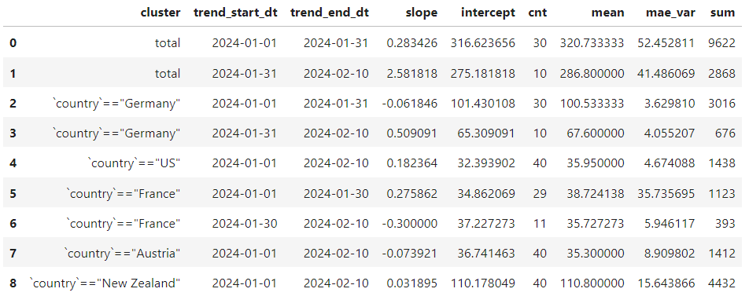
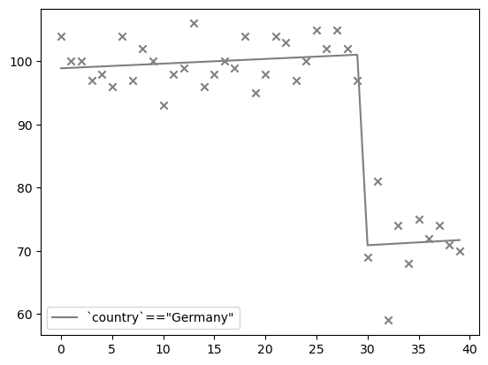
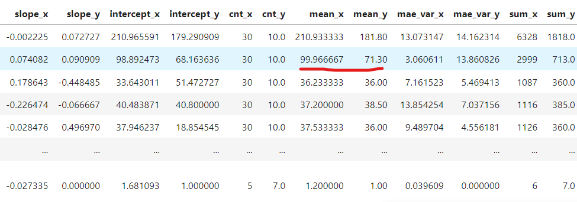
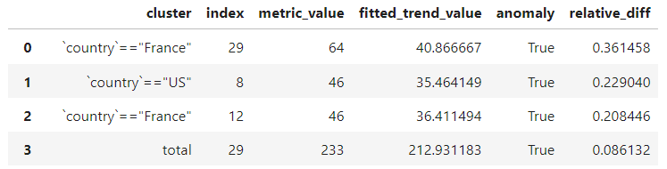
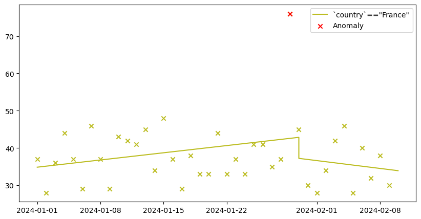

# Introduction to Anomeda

**anomeda package helps you analyze non-aggregated time-series data with Python and quickly indentify important changes of your metric**.

Here is a brief example of how **anomeda** can work for you.

> "Why has the number of our website visits decreased a week ago? What kind of users caused that?" - anomeda will answer such questions quickly by processing **non-aggregated** visits of your website. <br><br>
> It will show you, for instance, that users from the X country using the Y device suddenly stopped visiting your website. Not only that, even if you are not aware of any significant change of the number of visits, anomeda will highlight the cluster of events where it happened. <br><br>
> Is it fraudulent activity, a paused marketing campaign or technical issues? It's up to you to investigate.

The package is easy-to-use and adjustable enough to meet a wide range of real scenarios. The basic object, `anomeda.DataFrame`, inherits `pandas.DataFrame`, so you will find the API familiar. In addition, there are different options for fine-tuning alghorithms used under the hood.

Some of what **anomeda** can do for your **non-aggregated data**:

- Highlight time points and clusters when the trend, mean or variance changed
- Fit trends for any cluster considering the points where trends change
- Highlight time points and clusters if the anomalies were observed, considering trend at that moment
- Compare time periods and find clusters changing the metric

Find the project in its [GitHub repo](https://github.com/AntonSarr/anomeda).

Explore the [Documentation of anomeda](https://anomeda.readthedocs.io/en/latest/).

# Quick start

Let's imagine you oversee the number of visits of a website.

You have a table with visits. Typically you just aggregate them by a datetime column and monitor from 3 to 5 dashboards with overall number of visits, as well as visits of important pages, visits from specific systems, visits of specific users clustes, etc. Here is what you would do with **anomeda**.

Let's define an anomeda object.

```python
import anomeda

anomeda_df = anomeda.DataFrame(
    df, # pandas.DataFrame
    measures_names=['country', 'system', 'url', 'duration'], # columns represending measures or characteristics of your events
    measures_types={
        'categorical': [;'country', 'system', 'url'], 
        'continuous': ['duration'] # measures can also be continuous -  anomeda will take care of clustering them properly 
    },
    index_name='date',
    metric_name='visit', # dummy metric, always 1
    agg_func='sum' # function that is used to aggregate metric
)
```

`anomeda.DataFrame` inherits `pandas.DataFrame`, so you can treat them similarly. 

---
**NOTE**

Some *pandas* methods are not yet adapted for *anomeda*. They return a new `pandas.DataFrame` instead of a `anomeda.DataFrame`. You just need to initialize an *anomeda* object with a returned object in that case. 

---

Let's try to extract trends for important clusters from the data.

```python
trends = anomeda.fit_trends(
    anomeda_df,
    trend_fitting_conf={'max_trends': 'auto', 'min_var_reduction': 0.75}, # set the number of trends automatically,
                                                                          # try to reduce error variance compared to error of estimating values by 1-line trend by 75%
    breakdown='all-clusters', # fit trends for clusters extracted from all possible sets of measures
    metric_propagate='zeros', # if some index values are missed after aggregation for a cluster, fill them with zeros
    min_cluster_size=3 # skip small clusters, they all will be combined into 'skipped' cluster
)
```

Typically you will see something like this:



You can then plot the trends using the `plot_trends` method. You can choose a specific cluster or plot them all together.

```python
anomeda.plot_trends(anomeda_df, clusters=['`country`=="Germany"'])
```

The output will look like this:



Of course, you may have no idea which cluster caused the problem and what to plot. Almost always you know only that there is a decrease of an overall metric and you need to find the culprits. Let's utilize another method -- `anomeda.compare_clusters`.

```python
anomeda.compare_clusters(
    anomeda_df,
    period1='date < "2024-01-30"',
    period2='date >= "2024-01-30"'
)
```

You see the clusters you fitted before and comparison between their characteristics. The result is quite hefty, but you can easily add your own metrics and sort clusters so that the cluster you are looking for will be on top. For example, look at how different means in the second cluster are. The second cluster corresponds to Germany (the first cluster consists of all events, so we are not interested in it now).



Finally, you can check if there are any point anomalies present in any of your clusters.

```python
anomeda.find_anomalies(
    anomeda_df, 
    anomalies_conf: {'p_large': 1, 'p_low': 1, 'n_neighbors': 3}
)
```

The output will look like this:



If you plot the metric with its clusters, it would look quite reasonable.



There are some nuances of how to use **anomeda** wisely and powerfully. For example, you may use same anomeda methods simply with numpy arrays, without creating DataFrame's! See full [Documentation](https://anomeda.readthedocs.io/en/latest/) for more details and hints.

# Installing

*anomeda* is availale from PyPI. You may run a `pip install` command:

`pip install anomeda`

Also, the [GitHub repo](https://github.com/AntonSarr/anomeda) contains the source and built distribution files in *dist* folder.

You must have such packages be installed:

- *pandas* 
- *numpy*
- *sklearn*
- *scipy*
- *matplotlib* 

# Contribution

You are very welcome to participate in developing to the project. You may solve the current issues or add new functionality - it is up for you to decide.

Here is how your flow may look like:

1. Preparing your Fork
    - Click ‘Fork’ on Github, creating e.g. yourname/theproject.
    - Clone your project: git clone git@github.com:yourname/theproject.
    - cd theproject
    - Create and activate a virtual environment.
    - Install the development requirements: pip install -r dev-requirements.txt.
    - Create a branch: git checkout -b my_branch

2. Making your Changes
    - Make the changes
    - Write tests checking your code works for different scenarious
    - Run tests, make sure they pass.
    - Commit your changes: git commit -m "Foo the bars"

3. Creating Pull Requests
    - Push your commit to get it back up to your fork: git push origin HEAD
    - Visit Github, click handy “Pull request” button that it will make upon noticing your new branch.
    - In the description field, write down issue number (if submitting code fixing an existing issue) or describe the issue + your fix (if submitting a wholly new bugfix).
    - Hit ‘submit’!

# Reporting issues

To report an issue, you should use [Issues section](https://github.com/AntonSarr/anomeda/issues) of the project's page on Github. We will try to solve the issue as soon as possible.

# Contacts

If you have any questions related to **anomeda** project, feel free reaching out to the author.
