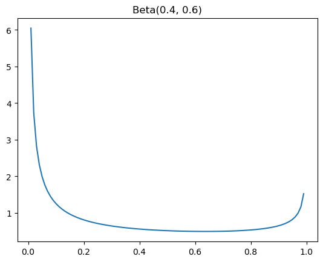

# Usage Guide

## What is anomeda.DataFrame

`anomeda.DataFrame` is class used to store the time-series data and its metadata. It inherits `pandas.DataFrame`. One of the implications of that fact is that `anomeda.DataFrame.__init__` processes the same parameters as its ancestor and *a few more*. Specifically:

::: DataFrame.DataFrame
    options:
      heading_level: 5
      show_docstring_classes: false
      merge_init_into_class: true
      show_root_heading: false
      show_root_full_path: false
      show_docstring_examples: false
      show_docstring_description: false
      show_bases: false
      members:
      - __init__
    
As you may have noticed, most of the parameters are optional. If you don't specify a parameter, a default value will be used. Or you will be notified once you use `anomeda.fit_trends`, `anomeda.find_anomalies` or other methods that you need to specify something additionally.

Note that it is recommended to use **datetime-like index** or **integer index**. You can map change the type of your index to datetime, for example, using `pandas.to_datetime`. Anomeda will try to change the type automatically, but it may cause unexpected results. If it failes, it will try to convert index values to *int64*.

Here is some examples of how you can initialize a new `anomeda.DataFrame`:

```python
# With just a pandas.DataFrame and metric name
anomeda.DataFrame(pandas_df, metric_name='my_metric')

# With some measures
anomeda.DataFrame(pandas_df, measures_names=['A', 'B', 'C'], metric_name='my_metric')

# In a pandas.DataFrame style
anomeda.DataFrame(
    {
        'A': [0, 1, 2],
        'B': [3, 4, 5],
        'C': [6, 7, 8],
        'my_metric': [10, 20, 30]
    }
    measures_names=['A', 'B', 'C'], 
    metric_name='my_metric'
)


# With a discretization mappging
anomeda.DataFrame(
    pandas_df, 
    measures_names=['A', 'B', 'C'], 
    metric_name='my_metric',
    discretized_measures_mapping={
        'A': {
            0: [[20, 80]],           # map values from 20 to 80 to 0 - "normal values"
            1: [[0, 20], [80, 100]], # map values from 0 and 20 or between 80 and 100 to 1 - "abnormal values"
        }
    }
)

# And many more...
```

---
**NOTE 1**

Some *pandas* methods are not yet adapted for *anomeda*. They return a new `pandas.DataFrame` instead of a `anomeda.DataFrame`. You just need to initialize an *anomeda* object with a returned object in that case. 

---

**NOTE 2**

The scale of undex increments is extracted automatically. It can be 1 (*Integer*, if your index are integers) or a part of a timestamp (*second*, *minute*, *hour*, etc). 

For example, if your index consists of two values ['2024-01-01 00:00:00', '2024-01-01 00:01:00'], the step is *hour*. However, the step may become *minute* once you add only one value - ['2024-01-01 00:00:00', '2024-01-01 00:01:00', '2024-01-01 00:01:**01**'], since *minute* is the smallest increment now.

By default, anomeda does not propagate metric values for the missing index values in clusters. However, you can specify a different option by providing `metric_propagate` parameters to `anomeda.fit_trends`. It can be *"zeros"* (fill missing metric values with zeros), *"ffil"* (use the last present metric value) or *None* (do not fill any missing values, treat them as it is).

---

A list of methods available to manipulate `anomeda.DataFrame`, such as *getters*, *setters*, *copying*, *modifying the object*, etc. Please follow [anomeda.DataFrame API Reference](dataframe_api.md) for the details. Her is the full list:

::: DataFrame.DataFrame
    options:
      heading_level: 6
      show_docstring_classes: false
      merge_init_into_class: false
      show_root_heading: false
      show_root_full_path: false
      show_docstring_examples: false
      show_docstring_description: false
      show_docstring_parameters: false
      show_docstring_examples: false
      show_docstring_returns: false
      show_signature: false
      show_bases: false

## How we handle continuous measures

Measures with continuous values are mapped to discrete ones by [`sklearn.mixture.BayesianGaussianMixture`](https://scikit-learn.org/stable/modules/generated/sklearn.mixture.BayesianGaussianMixture.html) by default. It helps to divide the data into interpretable clusters. Usually the mapped values represent more or less isolated ranges where the feature is concentrated, like "tiny", "medium", "large" or other categories. The `anomeda._to_discrete_values` is responsible for the transformation, you may redefine it if needed.

You can pass specific discrete values of a continuous measure both when creating an anomeda.DataFrame object and later. See `discretized_measures` parameter of `anomeda.DataFrame.__init__` or `anomeda.DataFrame.set_discretized_measures`. Alternatively, you may pass a mapping describing how to transform your continuous values into discrete ones, see the `discretized_measures_mapping` parameter of `anomeda.DataFrame.__init__` or `anomeda.DataFrame.set_discretization_mapping`.

You can then access the mapping and the discretized values by `anomeda.DataFrame.get_discretization_mapping` and `anomeda.DataFrame.get_discretized_measures` respectively.

## How we fit trends

Anomeda can fit trends of a time-series. Why trends, but not a trend? Becuase it can automatically identify when a trend changes and return not one, but actual number of trend. 

All the work is made by `anomeda.fit_trends` method. It can fit trends, plot them and assign it to the `anomeda.DataFrame._trends` attribute for reusing.

::: utils.fit_trends
    options:
      heading_level: 5
      show_docstring_description: false
      show_root_heading: false

The underlying algorithm starts with one trend. It estimates the parameters of a linear function. by optimizing.

After one trend is fitted, the algorithm tries to find a point which will reduce the an interesting metric, *variance of an absolute error (VAE) multiplied by 90-th percentile of an absolute error*, if we "break" the trend there and reestimate trends for the left and the right part of a time-series. The left and right trends which reduce the VAE the most are now our current trends. If we already fitted enough trends, defined by `max_n_trends`, or the current VAE is at least by `min_var_reduction` lower from what we saw using one trend, the algorithm stops and returns the trends. Otherwise, it starts to "break" each trend into two pieces the same way as described.

When a breaking point is being searched, either all points with presented data or a randomly sampled points are used as candidates. What is important, a kind of a *regularization* is used during the search. Choosing a point located closer to the ends of an index range is penalized more than closer to the center. We use PDF of Beta-function as a multiplicator. It was made to balance the number of samples in the left and right parts of the range. The low number of samples in one of the parts may cause a lower error variance there, which will hinder extracting long and consistent trends. 



The method returns all the trends and the breaking points:


If you plot one of them with `anomeda.plot_trends`, you may see what the result looks like:


While fitting trends, the method also stores clusters to `anomeda.DataFrame._clusters`. If you want to query them in other methods, remember that you must query them exactly how they are called in this property (only measures may have a different order). The syntax is the following: "\`measure_name_1\`==measure_value_1 and \`measure_name_1\`==measure_value_1 and ...". Also, note that discretized values of continous measures are used as measure values in clusters definitions.

## How we detect anomalies

The algorithm of detecting anomalies is based on comparing observed values with values of a fitted trend. Sounds simple, doesn't it?. The interesting part is how the anomalies are identified based on its differences from a trend.

Once differences between observed values and fitted trend are calculated, we apply the [`Local Outlier Factor`](https://scikit-learn.org/stable/modules/generated/sklearn.neighbors.LocalOutlierFactor.html) algorithm with a provided `n_neighbors`. It identifies "isolated" (without many neighbors) points or clusters and mark them as outliers. So, we find differences which are too rare, i.e. little or no points have similar difference. Such an alghorithm let us handle data with a high variance where lot's of differences are far from the trend, as well as not to mark points as anomalies if there are none of them. Once we identified abnormal clusters, we filter points with only *the lowest* and *the highest* differences, meaning for each *low-value anomaly* there must be no normal points with a difference lower than given, and similarly for the *high-value anomalies* - no points must have a difference higher than given. Finally, the amount of points to return is customized with `p_large` and `p_low` parameters which set the fraction of the most extreme points to return. The parameters vary from 0 to 1.

Anomalies are identified with `anomeda.find_anomalies` method.

::: utils.find_anomalies
    options:
      heading_level: 5
      show_docstring_description: false
      show_root_heading: false


